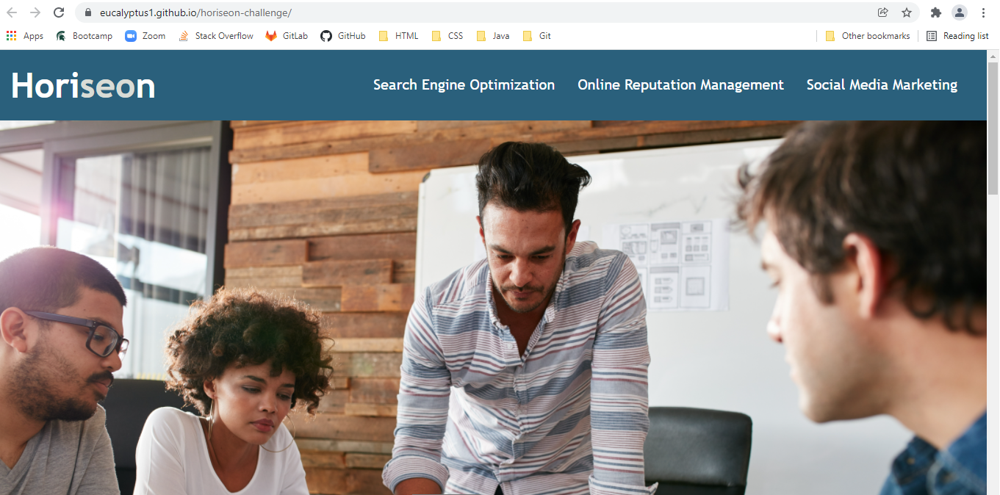

# Horiseon

## Purpose
A company that optimizes websites to be more search compliant and accessible.

## My purpose in this challenge
To both refactor the code of their main page to ensure it itself is accessible for search engines and assistive technologies and organize the code where needed, to be be accessible for future updates.

## Built with
*HTML
*CSS

## Website
https://eucalyptus1.github.io/horiseon-challenge/

## Contribution
Refactored by James
&copy 2019 Horiseon Social Solution Services, Inc.

